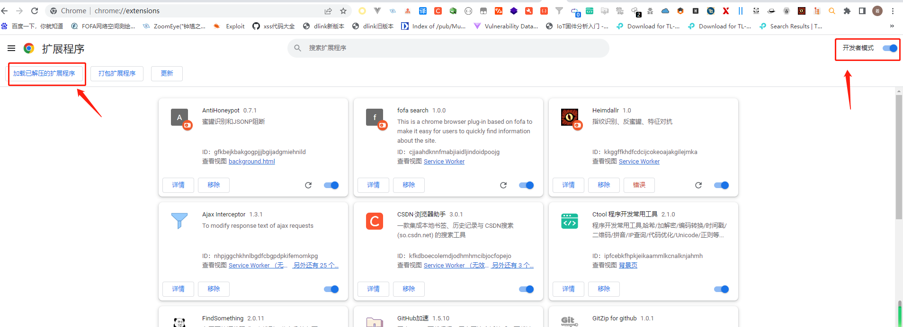
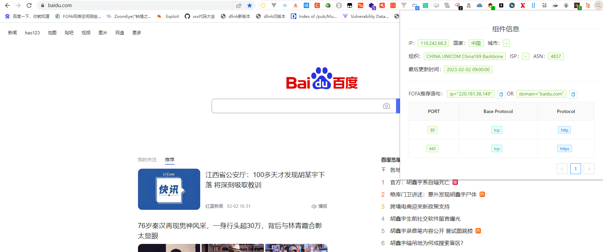

# Fofa Search

## 简介

本插件所采用的技术为vue3+ant开发，调用api如下

```
https://fofa.info/hosts/
https://amap.fofa.info/host/
```

***如果插件中两个ip不一致那么只有一种可能此站点是使用了cdn技术**

## Dev开发调试

安装依赖

```bash
npm install or cnpm install or yarn install
```

## dev开发

```bash
npm run build-watch or npm run server
```

## Prod生产环境

```bash
npm run build
```

## Eslint语法检查

```bash
npm run lint
```

## 导入步骤

 

选择生成的dist目录下面的文件，单机确定就可以。
***目前支持Edge和Chrome，火狐目前的V3版本是测试阶段暂时不支持后面官方上线后将会进行适配。**

 

## 发布

- 目前已在chrome尝试上架发布。

## 时间线

-  2023-02-02 Github开源发布，Chrome商店提交审核上架。
